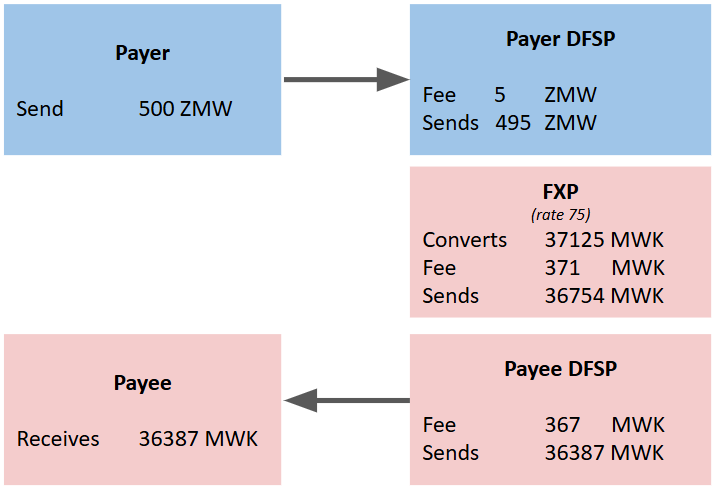
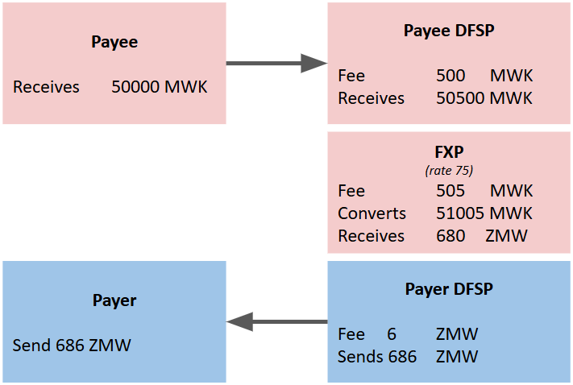

# Fees
This section provides a detailed description of what fees can be charged and how these fees are executed and collected.

## Fee types / categories
There are four categories of fees. This documentation describes in detail the transaction based fees, but it is important to understand that there are other types of fees that are not covered in this documentation.

1. **Transaction based fees (Participant Organisation Fees)** <br>These are per fees that are charged per transaction, and paid by the end consumer. All participant organisation can apply this fee. I.e. Payer DFSP, FXP and Payee DFSP. <br> The Payee DFSP & FXP fees are included in the clearing amount of the transaction. <br> I.e. They are pre-funded and settled during settlement.
1. **Non-transaction based fees** <br> E.g. Hub Connection Fees: These fees are charged by the hub operator to Participant Organisations connecting to the payment hub. They are defined by the participant scheme agreement. No special mechanism is needed to invoice and settle these fees.
1. **Interchange Fees** <br> This is a mechanism where more elaborate per transaction fee can be applied by the hub.
1. **Fee commissions** <br> This is where a participant organisation involved in a transaction can choose to subsidise fees incurred by other participant organisation involved in a transaction.

## Transaction Based Fees
These are Participant Organisation Fees. I.e. all Participants in a Transaction are able to add/include their fees at the time of the transaction. In order to describe in details, this document describe how the fee is applied and collected based on the participants role in the transaction. I.e. we will discuss how transaction fees are applied as:
1. A Payer DFSP
1. An FXP (Foreign Exchange Provider)
1. A Payee DFSP

### Fees charged to either the creditor or debtor 
In instant payment systems, two cross-border payment models are commonly supported, each defining how the transaction amount and associated fees are calculated and charged:
1. **P2P “Send Money” Transfer** <br>The transfer amount is specified in the **source currency**, representing the **amount debited from the sender’s account**. In this model, the **creditor (recipient)** bears the transaction fees. Technically, this corresponds to the FSPIOP definition ```amountType = SEND``` and the ISO 20022 ChargeBearerType1Code = CRED (```CdtTrfTxInf.ChrgBr = CRED```).
1. **P2B “Merchant Payments”** <br> The payment amount is specified in the **target currency**, representing the **amount credited to the payee’s account.** In this model, the **debtor (payer)** bears the transaction fees, which are calculated and applied on top of the transfer amount. This aligns with the FSPIOP definition ```amountType = RECEIVE``` and the ISO 20022 ChargeBearerType1Code = DEBT (```CdtTrfTxInf.ChrgBr = DEBT```).

These models define not only the direction of value transfer but also how and where transaction fees are applied within the cross-border payment process.

### Payer DFSP Transaction Fee
This fee is not included in the hub messaging, as it is expected to be managed outside of the payment system.
1. **P2P (peer-to-peer): Send Money** <br> Fees are deducted before.<br> Hub Send Money Amount = Amount - Fee
1. **P2B (peer-to-business): Merchant Payment** <br> Fee is added before presenting terms to customer. <br> You will need to pay = Hub Source Amount + Fee.

### FXP Transaction Fee
Fees are included in the conversion terms;
that are then presented to Payer DFSP, and the Payer.
The fees are included in the clearing amount of the transaction. 
I.e. They are pre-funded and settled during settlement.
1. **P2P: Send Money** <br> Fees are included in the terms <br> Target Currency Amount = Conversion Amount - Fee
1. **P2B: Merchant Payment** <br> Fees are included in the terms. <br> Source Currency Amount = Conversion Amount + Fee

### Payee DFSP Transaction Fee
Fees are included in the transfer terms;
that are then presented to Payer DFSP, and the Payer.
The fees are included in the clearing amount of the transaction. 
I.e. They are pre-funded and settled during settlement.

1. **P2P: Send Money & P2B: Merchant Payment** <br>Fees are included in the transfer terms<br>Transfer amount = request amount + Fee

## Scheme specified maximum fee
Payment schemes have the objective of meeting the world bank and G20 targets to reduce cross border remittance fees to < 3% transferred amount.

Restriction of fees are placed on participant organisations. Details of which are included in the participant agreement and scheme rules of the scheme.

Next we will go through examples that shows detailed sequence diagrams to illustrate how are incorporated through participant integrations.

## P2P: Send Money Fees Example
 The transfer amount is specified in the **source currency**, representing the **amount debited from the sender’s account**. In this model, the **creditor (recipient)** bears the transaction fees. Technically, this corresponds to the FSPIOP definition ```amountType = SEND``` and the ISO 20022 ChargeBearerType1Code = CRED (```CdtTrfTxInf.ChrgBr = CRED```).
Here is an end-to-end example of how fees are calculated for all participant organisations using a P2P or Send Money scenario.


The Payer initiates a transfer of 500 ZMW to the Payee. The Payer DFSP charges a 1% fee (5 ZMW), leaving 495 ZMW for conversion. The FXP converts the remaining 495 ZMW to MWK at an exchange rate of 75, resulting in 37,125 MWK. The FXP then deducts their 1% fee (371 MWK), leaving 36,754 MWK for the Payee DFSP. Finally, the Payee DFSP applies their 1% fee (367 MWK), and the Payee receives 36,387 MWK.

Let's examine the message sequences that illustrate how this example impacts the messages being transmitted.
### P2P: Payer DFSP - Agreement of terms phase
- Payer Sends 500 ZMW
- Less Payer DFSP Fee of 5 ZMW
- Payer DFSP sends 495 ZMW


### P2P: FXP - Agreement of terms phase
- FXP convers 495 ZMW to 37125 MWK
- Less FXP fee of 371 MWK
- FXP Proposes to Send 36754 MWK


### P2P: Payee DFSP - Agreement of terms phase
- Payee DFSP proposes to deposit 36387 MWK
- After subtracting fee of 367 MWK
- From Send amount of 36387 MWK


### P2P: Payer DFSP - Transfer phase
The transfer phase executes the agreement of terms.


### P2P: FXP - Transfer phase
The transfer phase executes the agreement of terms.


### P2P: Payee DFSP - Transfer phase
The transfer phase executes the agreement of terms.


## P2B: Merchant Payment Fees Example
The payment amount is specified in the **target currency**, representing the **amount credited to the payee’s account.** In this model, the **debtor (payer)** bears the transaction fees, which are calculated and applied on top of the transfer amount. This aligns with the FSPIOP definition ```amountType = RECEIVE``` and the ISO 20022 ChargeBearerType1Code = DEBT (```CdtTrfTxInf.ChrgBr = DEBT```). Here is an end-to-end example of how fees are calculated for all participant organisations using a P2B or Merchant Payment scenario.


The Payer requests to pay the merchant 50,000 MWK (note that this amount is specified in the Payee's currency). The Payee DFSP charges a 1% fee (500 MWK), so the FXP needs to send 50,500 MWK. The FXP applies their 1% fee (505 MWK), requiring a total conversion amount of 51,005 MWK. At an exchange rate of 75, this translates to 680 ZMW needed to support the transfer. The Payer DFSP then adds their fee of 6 ZMW, meaning the Payer must pay 686 ZMW to complete this payment, while the Payee receives 50,000 MWK.

Let's examine the message sequences that illustrate how this example impacts the messages being transmitted.

### P2B: Payee DFSP - Agreement of terms phase
- Payee DFSP is asked to deposit 50000 MWK
- Payee DFSP add their fee of 500 MWK
- Payee DFSP specifies that they require receipt of 50500 MWK


### P2B: FXP - Agreement of terms phase
- FXP need to convert to 50500 MWK
- FXP fee of 505 MWK is first added
- FXP Proposes to convert 680 ZMW to provide 51005 MWK to cover fees.


### P2B: Payer DFSP - Agreement of terms phase
- Payer DFSP must send 680 ZMW
- Payer DFSP add their fee of 6 ZMW
- Payer must pay 686 ZMW 


### P2B: Payer DFSP - Transfer phase
The transfer phase executes the agreement of terms.


### P2B: FXP - Transfer phase
The transfer phase executes the agreement of terms.


### P2B: Payee DFSP - Transfer phase
The transfer phase executes the agreement of terms.

