# Foreign Exchange - Currency Conversion

The Mojaloop currency conversion functionality enables foreign exchange (FX) transactions, supporting multiple approaches for currency conversion within the ecosystem. Currently, the system implements **Payer DFSP currency conversion**, where the Payer DFSP (Digital Financial Services Provider) coordinates with a foreign exchange provider (FXP) to obtain liquidity in another currency to facilitate a transfer.

Future enhancements to the currency conversion design include:
1. **Payee DFSP conversion**  The Payee DFSP arranges for foreign exchange conversion.
1. **Reference currency conversion**  Both the Payer and Payee DFSPs engage with FXPs to convert funds via a reference currency.
1. **Bulk conversion**  DFSPs can procure currency liquidity from an FXP in bulk.

## Role of the Foreign Exchange Provider (FXP)

A core feature of Mojaloop's currency conversion capability is its support for a competitive FX marketplace, where multiple FXPs can provide real-time exchange rate quotes. This design fosters an open and dynamic environment for foreign exchange transactions.

The currency conversion process follows a three-step workflow:
1. **Quote Request**  The Payer DFSP requests a quote from an FXP. For example, a Zambian DFSP can obtain a conversion quote for a specific transfer.
1. **Quote Agreement**  The Payer DFSP reviews the exchange rate and terms provided by the FXP. Once accepted, the FXP locks in the rate.
1. **Transfer Finalization**  Upon notification from the Mojaloop scheme that the dependent transfer has been completed, the conversion process is finalized.

This streamlined approach ensures transparency and competitiveness in FX transactions, benefiting both DFSPs and end users.

## Impact of Amount Type on Currency Conversion

The Payer DFSP conversion implementation supports two distinct scenarios based on the amount type specified in the transaction:
1. **Sending funds in the source (local) currency**
1. **Making a payment in target (a foreign) currency**

### Sending Funds to an Account in Another Currency
In this use case, the **Payer DFSP** initiates a transfer using the amount type **SEND**, specifying the transfer amount in the payer's local currency (source currency). This method is commonly used for **P2P remittance** transfers, where the sender transfers funds in their local currency, and the recipient receives the equivalent amount in their respective currency after conversion.

### Currency Conversion Transfer (source currency)
Below is a simplified sequence diagram showing the flows between the Participant organizations, the foreign exchange providers and the Mojaloop switch for a currency conversion transfer specified in source currency. 

The flow is divided up into:
1. [Discovery Phase](#discovery-phase)
1. [Agreement Phase - Currency Conversion](#agreement-phase---currency-conversion)
1. [Agreement Phase](#agreement-phase)
1. [Payer DFSP presents terms to Payer](#payer-dfsp-presents-terms-to-payer)
1. [Transfer Phase](#transfer-phase)

#### Discovery Phase
The Payer DFSP identifies the Payee DFSP organization and confirms the account validity and currency.

#### Agreement Phase - Currency Conversion
The Payer DFSP makes a request to the FXP for liquidity cover for transfer. The currency conversion terms are returned.
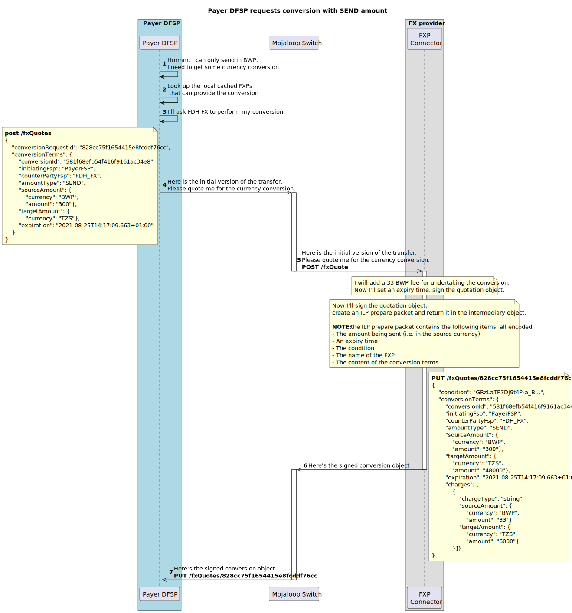

#### Agreement Phase 
The Payer DFSP makes a request to the Payee DFSP for the transfer terms.
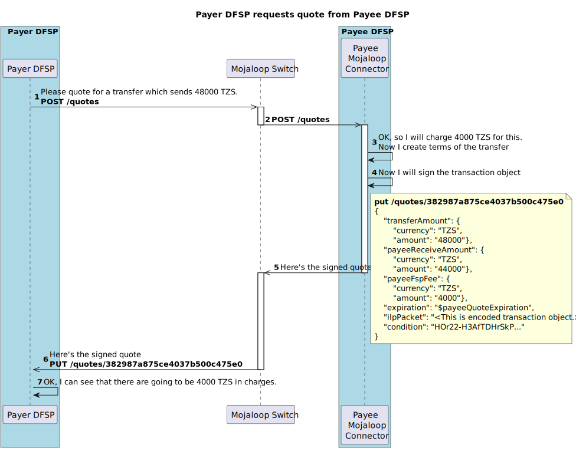

#### Payer DFSP presents terms to Payer
At this point the party information, the conversion terms, and the transfer terms have been provided to the Payer DFSP. The Payer DFSP presents these terms to the Payer and asks wether to proceed or not.
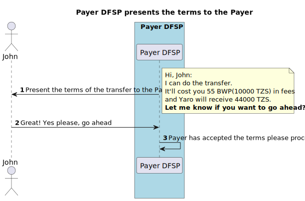

#### Transfer Phase
Now that the terms of the transfer have been agreed to, the transfer can proceed.
Both the Conversion and the transfer terms are committed together.
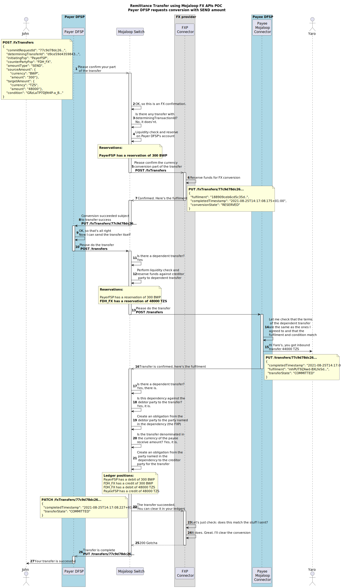

### Mojaloop Connector Integration for Currency Conversion

Below is a detailed sequence diagram that shows the complete flow, and includes the **Mojaloop Connector** and integration APIs for all participant organizations. (This is a useful view if you are building integrations as a participant organization.)

#### Discovery phase - Mojaloop Connector
Mojaloop make use of an Oracle to identify the DFSP organization associated with the Party identifier. The Payee DFSP must respond to the GET /parties to confirm that the account exists and is active for that Party identifier. The supported currencies for that account are returned.
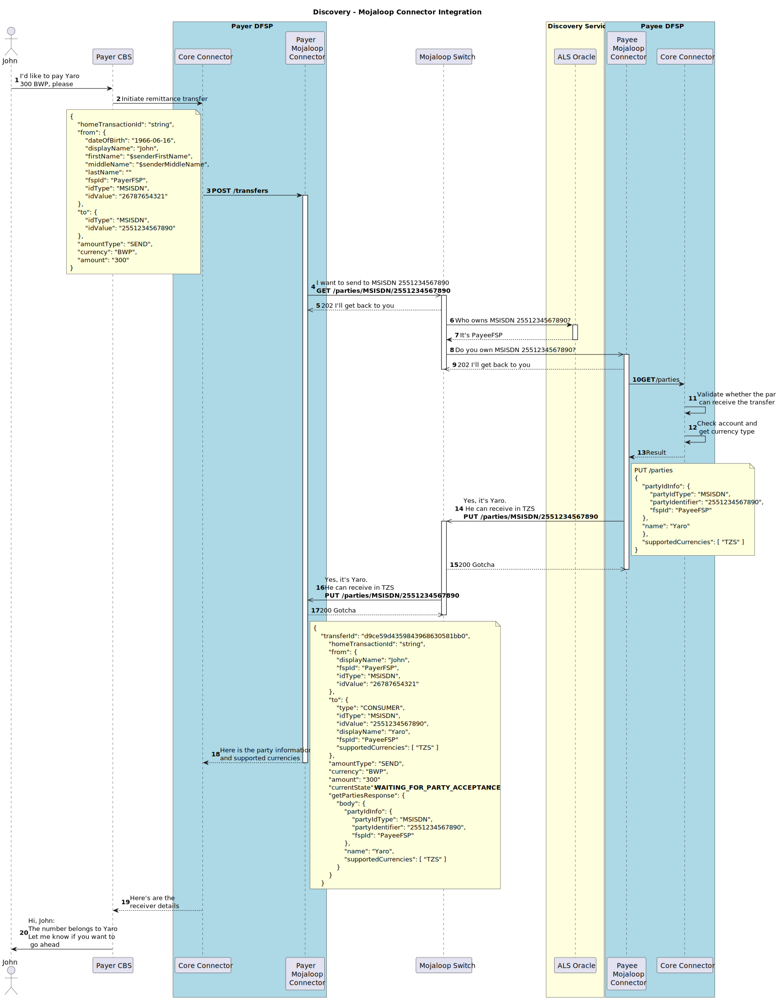

#### Agreement Phase Currency Conversion - Mojaloop Connector
The Payer DFSP does not transact in any of the Payee DFPSs supported currencies. This triggers the requirement for currency conversion inside the Mojaloop Connector. The Payer DFSP uses it's local cache of FXPs to select and makes a request to the Foreign Exchange provider for liquidity cover and a conversion rate.
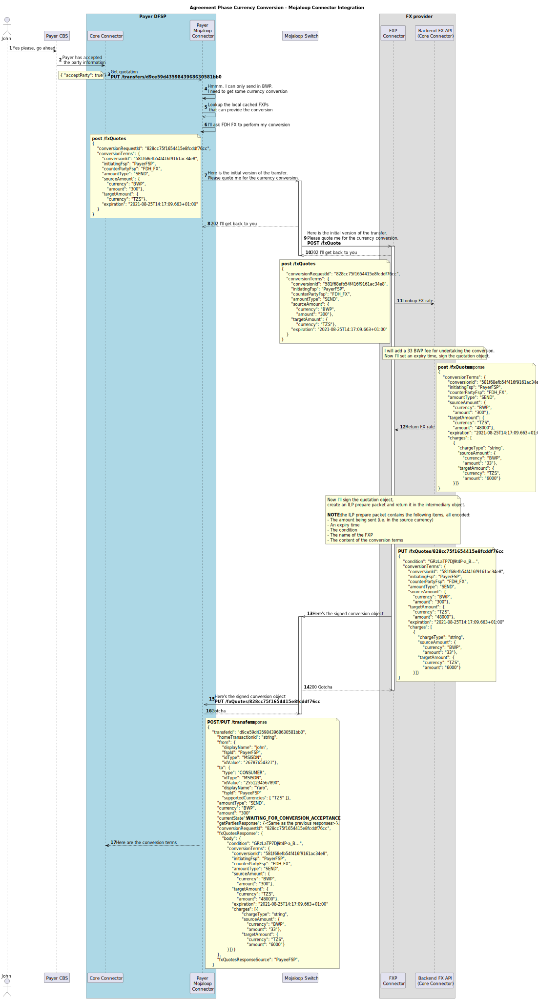

#### Agreement Phase - Mojaloop Connector
Liquidity in target currency has been secured. The Payer DFSP can now proceed to request an agreement of terms from the Payee DFSP. These terms are in target currency.
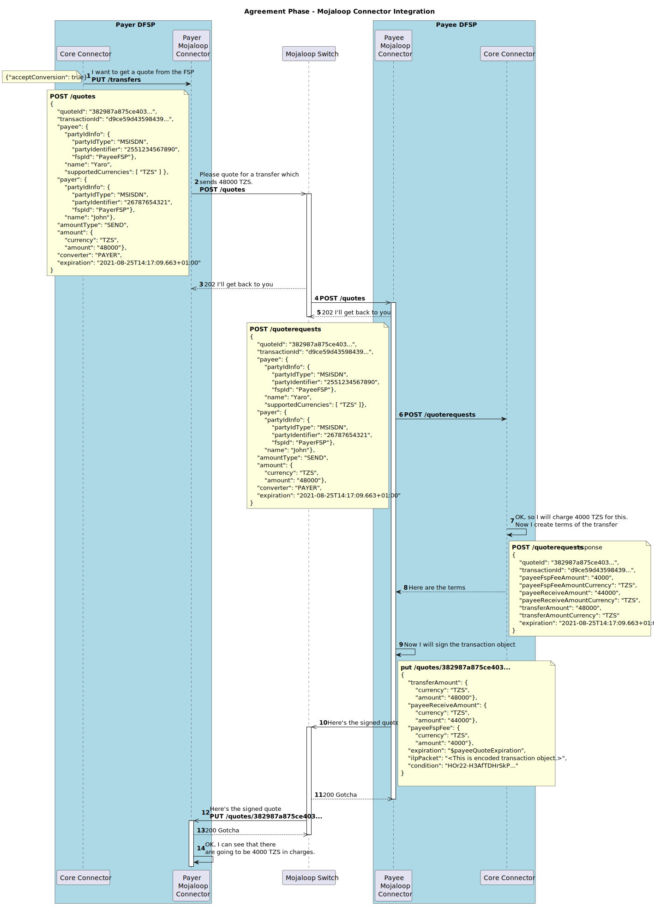

#### Sender Confirmation
All the terms for the currency conversion and transfer have been obtained by the Payer DFSP and FXP. It is now time to collate those terms and present them to the Payer for confirmation.
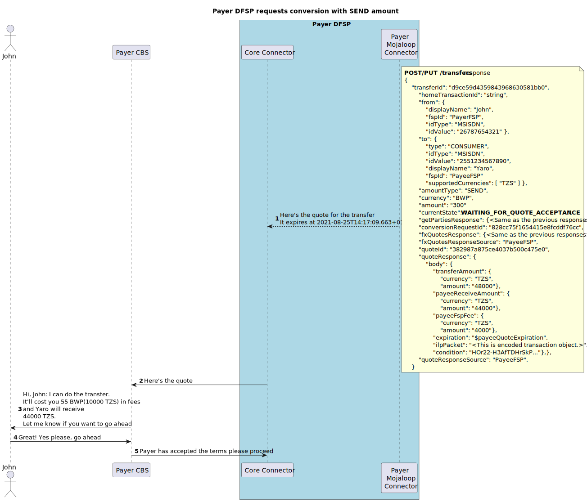

#### Transfer Phase
The terms of the transfer have been accepted. The transfer phase can now commence. 
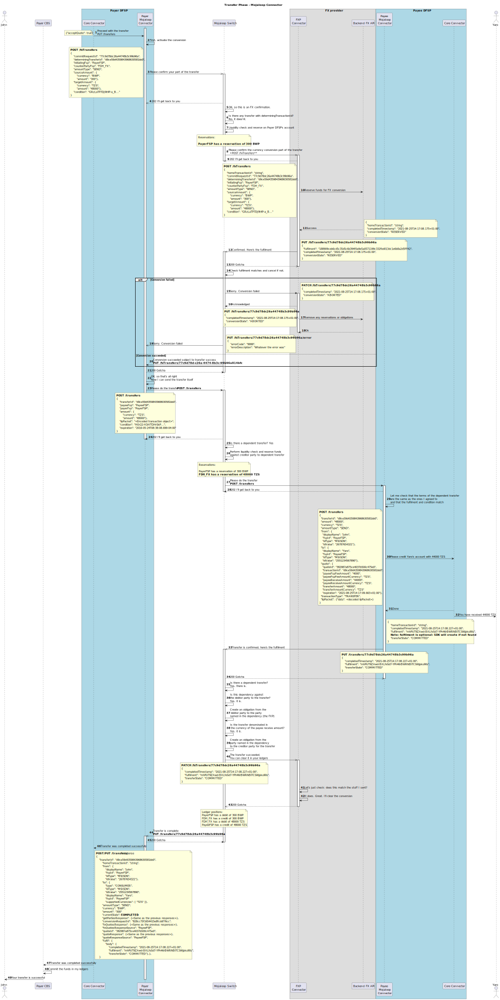

## Currency Conversion Transfer (target currency)
For this use case, the Payer DFSP will specify the transfer with amount type **RECEIVE** and define the transfer amount in the **Payee's local currency** (the target currency).
An secondary use case example for this is a cross boarder Merchant Payment.

Below is a detailed sequence diagram that shows the complete flow, and includes the Mojaloop connector and integration APIs for all participant organizations.

#### Discovery 
Mojaloop make use of an Oracle to identify the DFSP organization associated with the Party identifier. The Payee DFSP must respond to the GET /parties to confirm that the account exists and is active for that Party identifier. The supported currencies for that account are returned.
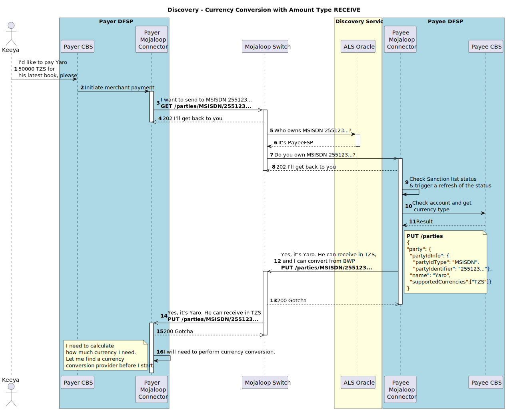

#### Agreement
The Payer DFSP does not support any of the Payee DFSP's currencies, requiring currency conversion within the Mojaloop Connector. Since the payment request is in the target currency, an agreement with the Payee DFSP must be established before initiating a liquidity request with the foreign exchange provider. The Payer DFSP first negotiates the transfer terms with the Payee DFSP, then uses its local cache of foreign exchange providers to select one and request liquidity coverage and a conversion rate.
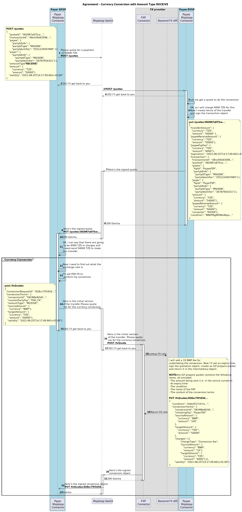

#### Sender Confirmation
All the terms for the currency conversion and transfer have been obtained by the Payer DFSP and FXP. It is now time to collate those terms and present them to the Payer for confirmation.
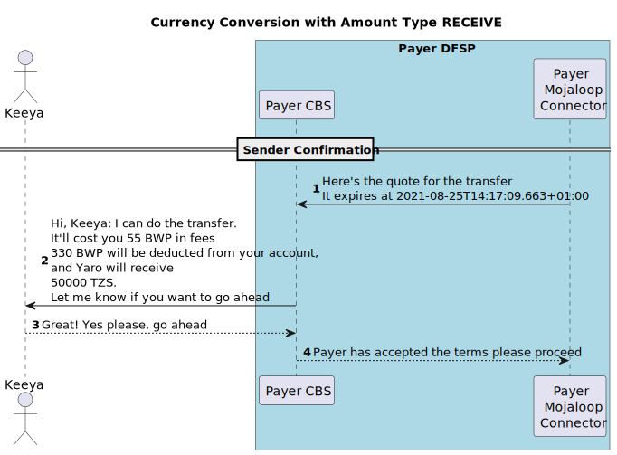

#### Transfer 
The terms of the transfer have been accepted. The transfer phase can now commence. 
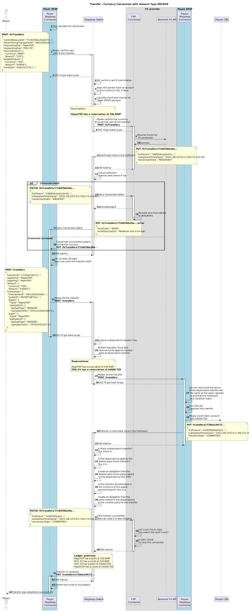

## Abort flows
This sequence diagram show how the design implements abort messages during the currency conversion transfer phase.

## Open API References
These Open API references are designed to be readable for both software an review person. The show the detailed requirements and implementations of the API design.

- [FSPIOP v2.0 specification](https://mojaloop.github.io/api-snippets/?urls.primaryName=v2.0) - [Open Api definition](https://github.com/mojaloop/mojaloop-specification/blob/master/fspiop-api/documents/v2.0-document-set/fspiop-v2.0-openapi3-implementation-draft.yaml).
- [FSPIOP v2.0 ISO 20022 specification](https://mojaloop.github.io/api-snippets/?urls.primaryName=v2.0_ISO20022) - [Open Api definition](https://github.com/mojaloop/api-snippets/blob/main/docs/fspiop-rest-v2.0-ISO20022-openapi3-snippets.yaml).
- [API Snippets Open Api definition](https://github.com/mojaloop/api-snippets/blob/main/docs/fspiop-rest-v2.0-openapi3-snippets.yaml)
- [Mojaloop Connector backend](https://mojaloop.github.io/api-snippets/?urls.primaryName=SDK%20Backend%20v2.1.0) - [Open Api definition](https://github.com/mojaloop/api-snippets/blob/main/docs/sdk-scheme-adapter-backend-v2_1_0-openapi3-snippets.yaml)
- [Mojaloop Connector outbound](https://mojaloop.github.io/api-snippets/?urls.primaryName=SDK%20Outbound%20v2.1.0) - [Open Api definition](https://github.com/mojaloop/api-snippets/blob/main/docs/sdk-scheme-adapter-outbound-v2_1_0-openapi3-snippets.yaml)
